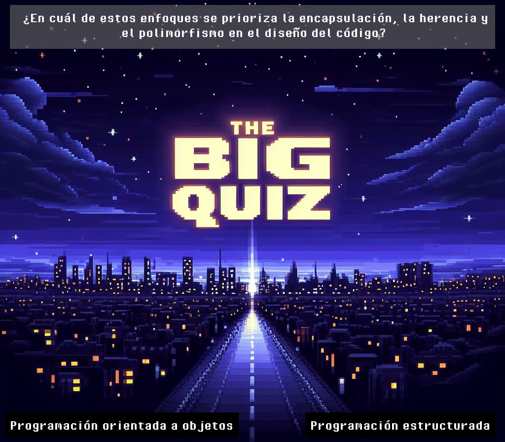

# The Big Quiz

*The Big Quiz* es un galardonado juego de preguntas que supone un desafío incluso para las mentes más brillantes, así que imaginate el esfuerzo infernal al que tu cerebro será sometido. Se pondrán a prueba tus conocimientos adquiridos en la carrera de Ingeniería en Sistemas, desde los principios de la informática, hasta la mecánica cuántica.

La inmersiva interfaz gráfica y la música estimulante crean el ambiente perfecto para estudiar. Y vas a tener que hacerlo, porque este juego no es una trivia casual como *Preguntados*, más bien, es una prueba de resistencia intelectual que no tolera la mediocridad. La frustración puede ser parte del viaje para aquellos que no estén a la altura del desafío que propone *The Big Quiz*.

## Controles

Elegís las opciones, izquierda o derecha, con las flechas del teclado. ¡Más sencillo, imposible! Ideal para vos.

## Reseñas

**elandres2**, ★★★★☆: *Un jueguito de nivel para disfrutar en la costa. De casualidad lo enganché mientras tiraba facha en la playa y, obvio, le di con todo. Acerté casi todas las preguntas jaja. Sin estudiar, pura chispa. Un consejo, de hombre a hombre: salí a la calle, dale charla a las pibas. No todo es estudio, bro. Dicho con buena onda, porque algunos tipos cobran por este tipo de sabiduría. Ahora que lo pienso, podría considerar el coaching. Manden follow en IG @elandres2 para más novedades. Saludos desde Mar del Plata ;)*

**CriticusSapientiae**, ★★★☆☆: *El videojuego en cuestión presenta interrogantes de elevada especificidad, en algunas instancias percibidas como irrelevantes. La trama, por desgracia, carece de la originalidad distintiva, y las alternativas de elección exhiben un tono subóptimo, revelándose como escasamente realistas, lo cual perturba el flujo lógico de la narrativa. Adicionalmente, ciertas decisiones conllevan consecuencias notoriamente severas, desafiando la coherencia con el desarrollo global de los acontecimientos. A pesar de su encomiable propuesta, se aguardaría una atención más marcada a la coherencia y la lógica en la trama, así como en las elecciones a disposición.*

**mariajuana**, ★★★★★: *Me mató el mate, literal!*
